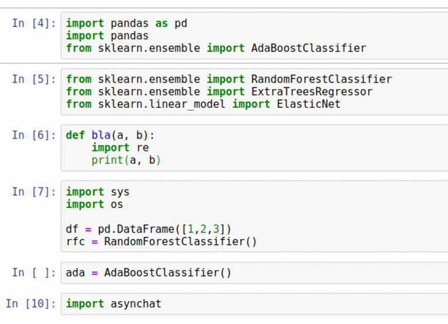

### cleanipynb


[](https://pypi.python.org/pypi/cleanipynb)
[](https://travis-ci.org/i008/clean_ipynb)


Cleans up dirty jupyter notebooks


> **WARNING**: Cleaning happens in-place - Be careful


### Usage:

```bash
pip install cleanipynb
cleanipynb path_to_your_notebook.ipynb
```

### Demo:



### Credits:

- jupytext
- importanize
- autoflake
- autopep8
